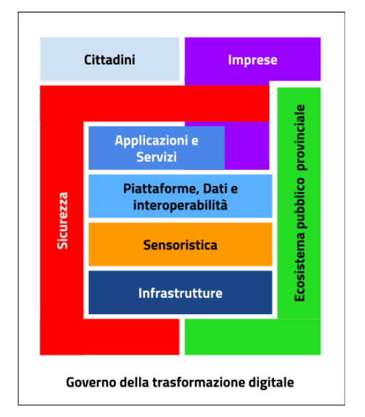

L’architettura strategica di Trento città digitale
===================================================

L’architettura strategica che sta alla base dell’Agenda Digitale di
Trento non può prescindere dell’intero insieme di sistemi ed attori che
popolano e animano la città: il Comune, i cittadini, gli enti pubblici
provinciali ed infine le imprese.

La rappresentazione del modello strategico,che definisce il **sistema
operativo della città** per macro ambiti, è la seguente:

|image1|

Le **Infrastrutture**, reti e datacenter, assicurano la base fisica di
funzionamento dell’intera architettura. Su di esse appoggiano
primariamente i sistemi di **Sensoristica** e IoT della città che
raccolgo informazioni o attuano le azioni necessarie all’erogazione dei
sottoservizi. I dati raccolti, insieme a quelli gestiti e prodotti dalle
Applicazioni, vengono fatti confluire in uno strato di
**Interoperabilità** che ha il compito primario di raccogliere e rendere
disponibili ai e dai livelli superiori o inferiori dati, informazioni e
servizi facilitano e di garantire la corretta interazione tra gli attori
del sistema (cittadini, imprese e pubbliche amministrazioni), favorendo
la condivisione trasparente di dati, informazioni, piattaforme e
servizi; a questo ambito appartengono anche le piattaforme abilitanti e
i shared services nazionali e provinciali.

Applicazioni e Servizi offrono le funzionalità richieste dai cittadini,
dalle imprese e dai dipendenti comunali per raggiungere gli scopi che si
sono prefissi. A loro volta le Imprese

La **Sicurezza** comprende le attività che concorrono a rendere sicuri e
affidabili i sistemi informatici, nonché le attività di indirizzo e la
strumentazione correlata agli adempimenti per il rispetto della
riservatezza (privacy).

L\ **’ecosistema pubblico provinciale** assicura e consuma a propria
volta infrastrutture, sensoristica, piattaforme abilitanti, dati e
interoperabilità , applicazioni e servizi e sicurezza in modo integrato.

I **Cittadini** consumano i servizi e le applicazioni ma contribuiscono
al miglioramento continuo in un’ottica di collaborazione. Le
**Imprese**, oltre a consumare servizi e applicazioni, collaborano nella
realizzazione dell’architettura strategica fornendo dati e servizi o
consumandoli in un’ottica integrata.

il Governo della trasformazione digitale è un componente definito per
far fronte alle necessità di coordinamento, gestione e monitoraggio
delle attività funzionali allo sviluppo del Piano. È trasversale ad
altri componenti e aggrega tutte le linee di azione, di governance e di
supporto alle PA coinvolte nella realizzazione del Piano.

